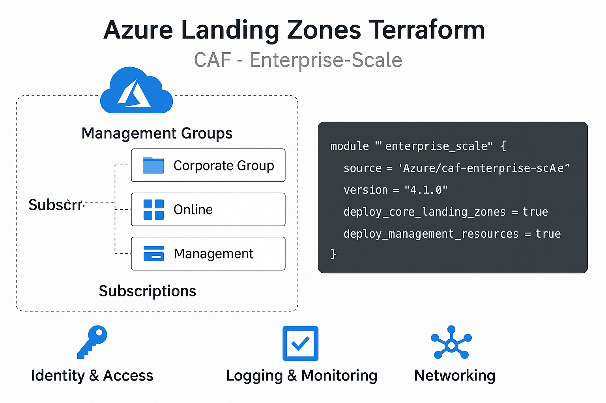

# 🌍 Azure Landing Zone with Terraform

هذا المشروع يُسهّل نشر **Enterprise-scale Landing Zone** على منصة Azure باستخدام **Terraform** و **CAF (Cloud Adoption Framework)** من مايكروسوفت.

## ❓ ما أهمية هذا المشروع؟

تمثل Landing Zones حجر الأساس لتطبيق مبادئ **حوكمة السحابة** و**البنية المؤسسية** في Azure. هذا المشروع يساعدك على:

- الانطلاق السريع في إنشاء بيئة Azure منظمة ومتوافقة مع أفضل الممارسات.
- تقليل الأخطاء اليدوية باستخدام **Infrastructure as Code**.
- تبنّي هيكل موحد وقابل للتوسع لإدارة الاشتراكات، الهوية، الشبكات، السياسات، وغير ذلك.

---

## 📦 محتويات المشروع

- 🔧 نشر هيكل Management Groups
- 🔐 تكوين الهوية (Identity)
- 🌐 تكوين الشبكات (Connectivity)
- 📜 تطبيق السياسات (Policies)
- 🛡️ إعداد الحوكمة والأمان (Governance & Security)

---

## 🧰 المتطلبات

- [Terraform](https://www.terraform.io/downloads)
- Azure CLI (مسجل الدخول بـ subscription مناسب)
- صلاحيات `Owner` أو `Management Group Contributor`

---

## 📁 هيكل الملفات

```bash
.
├── main.tf                     # استدعاء module Enterprise Scale
├── providers.tf               # تعريف Providers
├── terraform.tfvars           # القيم الخاصة بالبيئة
├── landingzone_configuration.json # تكوين الـ Archetypes
├── README.md
```

---

## 🚀 خطوات الاستخدام

### 1. تسجيل الدخول إلى Azure
```bash
az login
az account set --subscription "<your-subscription-id>"
```

### 2. تهيئة Terraform
```bash
terraform init
```

### 3. معاينة التغييرات
```bash
terraform plan
```

### 4. النشر
```bash
terraform apply -auto-approve
```

---

## 🧹 حذف الموارد

```bash
terraform destroy -auto-approve
```

---

## 📌 ملاحظات

- تأكد من ضبط القيم داخل `terraform.tfvars` و `landingzone_configuration.json`
- لا تنسَ تعديل `root_parent_id` ليتوافق مع بيئتك

---

## 📷 رسم توضيحي



---

## 👨‍💻 المطور

- **عماد عادل**
- MCT | Azure Solution Architect | Egypt Azure Community Lead

---

## 📎 المصادر

- [CAF Enterprise-scale Terraform module](https://registry.terraform.io/modules/Azure/caf-enterprise-scale/azurerm/latest)
- [Microsoft Cloud Adoption Framework](https://learn.microsoft.com/en-us/azure/cloud-adoption-framework/)